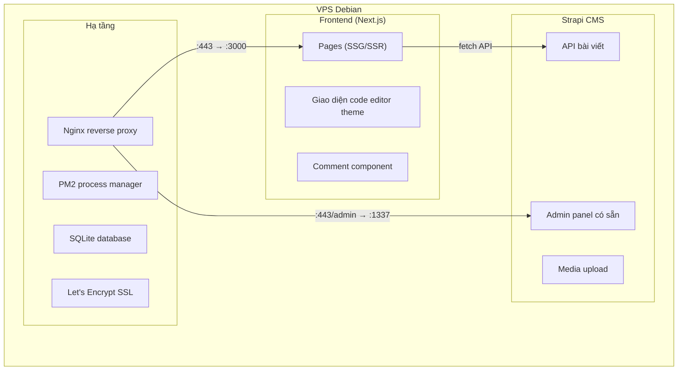

# Website cá nhân longnhx — Đề xuất Tech Stack & Kế hoạch triển khai

> Dựa trên bản phác thảo hiện tại, yêu cầu deploy trên VPS Debian, quản lý nội dung qua CMS, bảo vệ admin bằng mật khẩu đơn giản, và tích hợp comment.

## User Review Required

> [!IMPORTANT]
> **Đây là bản đề xuất tech stack và kiến trúc tổng quan.** Bạn cần review và phản hồi trước khi mình bắt tay vào code. Đặc biệt chú ý phần **Open Questions** bên dưới.

---

## 1. Đề xuất Tech Stack

### Tổng quan kiến trúc



### Frontend: Next.js (App Router)

| Tiêu chí | Lý do chọn |
|---|---|
| **Phù hợp beginner** | React-based, tài liệu tiếng Việt nhiều, cộng đồng lớn |
| **SEO tốt** | Static Generation (SSG) cho blog — Google index nhanh |
| **Linh hoạt** | Vừa có trang static (blog, projects) vừa có API routes |
| **Giữ được design** | Chuyển thẳng CSS hiện tại sang CSS Modules, không cần học Tailwind |
| **Deploy VPS dễ** | Chạy bằng PM2, reverse proxy qua Nginx |

> [!NOTE]
> Bạn hiện biết HTML/CSS/JS → Next.js dùng React (JSX) nên sẽ cần học thêm React cơ bản. Tuy nhiên đây là kỹ năng rất đáng đầu tư, và mình sẽ viết code với comment tiếng Việt giải thích rõ từng phần.

### CMS: Strapi (Self-hosted)

| Tiêu chí | Lý do chọn |
|---|---|
| **Open-source & miễn phí** | Tự host trên VPS, không tốn phí hàng tháng |
| **Admin UI có sẵn** | Giao diện soạn bài đẹp, hỗ trợ Markdown & rich text |
| **API tự động** | Tạo content type → tự sinh REST/GraphQL API |
| **SQLite** | Database nhẹ, không cần cài PostgreSQL — phù hợp blog cá nhân |
| **Media management** | Upload ảnh, quản lý file ngay trong dashboard |

**So sánh nhanh các CMS headless:**

| CMS | Self-host | Miễn phí | Admin UI | Độ khó | Phù hợp |
|---|---|---|---|---|---|
| **Strapi** ✅ | ✅ | ✅ | ✅ Đẹp, có sẵn | Trung bình | **Chọn** |
| Sanity | ❌ Cloud | Giới hạn | ✅ | Dễ | Phải trả phí khi scale |
| Directus | ✅ | ✅ | ✅ | Khó hơn | Quá phức tạp cho blog |
| Ghost | ✅ | ✅ | ✅ | Dễ | Quá chuyên về blog, ít customize |

### Database: SQLite

- Nhẹ, không cần cài đặt server riêng
- Strapi hỗ trợ native
- Backup dễ dàng (chỉ cần copy 1 file `.db`)
- Đủ mạnh cho blog cá nhân (hàng ngàn bài viết)

### Comment: Giscus

- **Miễn phí**, dựa trên GitHub Discussions
- Không cần database riêng cho comment
- User comment bằng tài khoản GitHub (phù hợp audience developer/sinh viên IT)
- Hỗ trợ reactions, threaded replies
- Không có spam vì cần GitHub account

---

## 2. Bảo mật

> [!IMPORTANT]
> Website không có user account, nhưng cần bảo vệ:
> 1. **Strapi admin panel** (mặc định có auth riêng — email/password)
> 2. **VPS server** (SSH, firewall, SSL)

### 2.1. Bảo mật Strapi Admin

```
Strapi đã có sẵn hệ thống auth:
- Đăng nhập bằng email/password
- Chỉ cần tạo 1 tài khoản admin duy nhất khi setup
- API bài viết: public (ai cũng đọc được)
- API tạo/sửa/xóa bài: chỉ admin (cần token)
```

### 2.2. Bảo mật VPS Debian

| Lớp bảo mật | Chi tiết |
|---|---|
| **SSH** | Tắt đăng nhập root, dùng SSH key, đổi port mặc định |
| **Firewall (UFW)** | Chỉ mở port 80, 443, SSH |
| **SSL/HTTPS** | Certbot + Let's Encrypt (miễn phí, tự gia hạn) |
| **Nginx** | Reverse proxy, ẩn port thật, rate limiting |
| **Strapi admin** | Giới hạn IP truy cập panel admin (optional) |
| **Headers bảo mật** | X-Frame-Options, CSP, HSTS qua Nginx |
| **Tự động update** | `unattended-upgrades` cho security patches |

### 2.3. Nginx Config (Sketch)

```nginx
# Frontend Next.js
server {
    listen 443 ssl;
    server_name longnhx;
    
    # SSL
    ssl_certificate /etc/letsencrypt/live/longnhx/fullchain.pem;
    ssl_certificate_key /etc/letsencrypt/live/longnhx/privkey.pem;
    
    # Security headers
    add_header X-Frame-Options "SAMEORIGIN" always;
    add_header X-Content-Type-Options "nosniff" always;
    add_header Strict-Transport-Security "max-age=31536000" always;
    
    # Frontend
    location / {
        proxy_pass http://127.0.0.1:3000;
    }
    
    # Strapi Admin (có thể giới hạn IP)
    location /strapi/ {
        # allow YOUR_IP;    # Chỉ cho phép IP của bạn
        # deny all;
        proxy_pass http://127.0.0.1:1337/;
    }
}
```

---

## 3. Cấu trúc dự án

```
myweb/
├── frontend/                    # Next.js app
│   ├── app/
│   │   ├── layout.js           # Root layout (fonts, metadata)
│   │   ├── page.js             # Home page
│   │   ├── blog/
│   │   │   ├── page.js         # Blog listing
│   │   │   └── [slug]/
│   │   │       └── page.js     # Blog detail + comment
│   │   ├── projects/
│   │   │   └── page.js         # Projects & mini-tools
│   │   └── globals.css         # CSS từ phác thảo, chuyển sang CSS Modules
│   ├── components/
│   │   ├── WindowChrome.js     # Khung cửa sổ code editor
│   │   ├── TabBar.js           # Navigation tabs
│   │   ├── Terminal.js         # Terminal snippet (hero)
│   │   ├── PostRow.js          # Blog post item
│   │   ├── ProjectCard.js      # Project card
│   │   ├── WordCounter.js      # Mini-tool đếm từ
│   │   └── Comments.js         # Giscus wrapper
│   ├── lib/
│   │   └── strapi.js           # Fetch helper cho Strapi API
│   ├── package.json
│   └── next.config.js
│
├── cms/                         # Strapi CMS (auto-generated)
│   ├── src/
│   │   └── api/
│   │       ├── post/            # Content type: Blog post
│   │       └── project/         # Content type: Project
│   ├── config/
│   │   └── database.js          # SQLite config
│   └── package.json
│
├── deploy/                      # Scripts deploy
│   ├── nginx.conf               # Nginx config
│   ├── setup-vps.sh             # Script cài đặt VPS
│   └── ecosystem.config.js      # PM2 config
│
└── README.md
```

---

## 4. Lộ trình triển khai (Phases)

### Phase 1: Frontend cơ bản (không CMS)
- Chuyển phác thảo HTML → Next.js components
- Giữ nguyên design code editor theme
- Hard-code data tạm (giống phác thảo hiện tại)
- Responsive, dark/light nếu cần
- **Kết quả**: Website chạy local, nhìn giống phác thảo nhưng code sạch hơn

### Phase 2: Tích hợp Strapi CMS
- Cài Strapi, tạo content types (Post, Project)
- Kết nối frontend với Strapi API
- Trang chi tiết bài viết với Markdown rendering
- **Kết quả**: Soạn bài trên Strapi → hiển thị trên web

### Phase 3: Comment & tính năng bổ sung
- Tích hợp Giscus cho comment
- Mini-tool đếm từ (giữ từ phác thảo)
- SEO optimization (meta tags, sitemap, robots.txt)

### Phase 4: Deploy lên VPS
- Cài đặt Nginx, PM2, Certbot
- Config bảo mật
- CI/CD đơn giản (git pull + restart)

---

## Open Questions

> [!IMPORTANT]
> **Câu 1: Domain**
> Bạn đã có domain `longnhx` chưa? Hay đang dùng tên khác? Cần biết để config đúng.

> [!IMPORTANT]
> **Câu 2: VPS hiện tại**
> Bạn đã có VPS Debian chưa? Nếu có, specs bao nhiêu RAM/CPU? (Strapi cần tối thiểu ~1GB RAM)

> [!WARNING]
> **Câu 3: Giscus yêu cầu GitHub account**
> Comment bằng Giscus nghĩa là người comment cần có tài khoản GitHub. Nếu audience của bạn không phải developer, có thể cân nhắc dùng **Cusdis** (comment ẩn danh, self-hosted, nhẹ hơn). Bạn thích phương án nào?

> [!NOTE]
> **Câu 4: Bắt đầu từ đâu?**
> Mình có thể bắt đầu ngay **Phase 1** — chuyển phác thảo sang Next.js. Bạn muốn mình bắt đầu code luôn hay cần điều chỉnh gì trong plan?

---

## Verification Plan

### Phase 1 Verification
- Chạy `npm run dev` → kiểm tra giao diện trùng khớp với phác thảo
- Responsive test (mobile, tablet, desktop)
- Lighthouse audit (Performance, Accessibility, SEO)

### Phase 2 Verification
- Tạo bài viết trên Strapi → hiển thị trên frontend
- Test API security (không cho phép tạo bài khi chưa đăng nhập)

### Phase 3 Verification
- Test comment flow (đăng nhập GitHub → comment → hiển thị)
- SEO: kiểm tra meta tags, sitemap.xml

### Phase 4 Verification
- HTTPS hoạt động (SSL check)
- Security headers (securityheaders.com)
- Load test cơ bản
